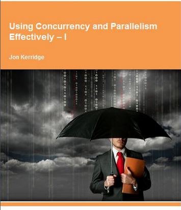

= GPars - Groovy Parallel Systems 
Jon Kerridge <j.kerridge@napier.ac.uk>
v1.2.1, 2015-12-01
:linkattrs:
:linkcss:
:imagesdir: ../images
:toc: right
:toc-title: Document Index
:icons: font
:source-highlighter: coderay
:docslink: http://www.gpars.org/guide/[GPars Docs]
:description: GPars is a multi-paradigm concurrency framework offering several mutually cooperating high-level concurrency abstractions.

image::gpars-rgb.svg[GPars Logo,320,align="center",link="./"]

''''

== Let’s Do It in Parallel

*Groovy Parallel Programming for Java Developers* 

.Jon Kerridge
****
School of Computing Edinburgh Napier University, Scotland 

email: j.kerridge@napier.ac.uk image:jon2.jpg['Jon Kerridge',135,135,role="thumb right"]

Tel. +44 (0)131 455 2777

Room D30, Merchiston Campus
 
10 Colinton Road

Edinburgh, Scotland EH10 5DT
****

.17 Nov.2015
****
Hi Team,

The following documents you refer to have now been superseded by a published text book, which comes in two parts.

The text is available free from http://bookboon.com/[bookboon.com]

The quickest way is to search for 'bookboon kerridge',  which is the way I find my books.  In total the books have now been downloaded about 250,000 times up till June 2015.

 The actual links are:

 * part 1 which is the concurrency stuff: http://bookboon.com/en/using-concurrency-and-parallelism-effectively-i-ebook[Using Concurrency and Parallelism Effectively - Part 1]
 * part 2 which is the parallel stuff: http://bookboon.com/en/using-concurrency-and-parallelism-effectively-ii-ebook[Using Concurrency and Parallelism Effectively - Part 2]

there is a link on the pulisher's web site to the code and underlying libraries

So the easiest thing would be to provide a link to these two books so that people can follow then!

I am in the process of writing a follow on book looking at JCSP based parallel patterns but it very much in the development stage at the moment!!

Hope this helps and saves you a lot of effort!!

Jon

Professor Jon Kerridge

School of Computing, Edinburgh Napier University, Merchiston Campus

Edinburgh, EH10 5DT
 
Tel. (0044) 0131 455 2777

email: mailto:j.kerridge@napier.ac.uk[j.kerridge@napier.ac.uk]

http://www.soc.napier.ac.uk/~cs10/[http://www.soc.napier.ac.uk/]
****

== Jon Kerridge

 * Faculty of Engineering, Computing & Creative Industries
 * Job Title: Professor
 * School: School of Computing
 * Subject Group: Software Engineering
 * Edinburgh Napier University, Scotland
 * http://www.napier.ac.uk[http://www.napier.ac.uk]

''''

=== Introduction

The aim of this book is to show both students and practitioners that concurrent and parallel programming does not need to be as hard as it is often portrayed and in fact is often easier that building the equivalent sequential system. 
This will be achieved by presenting a set of example systems that demonstrate the underlying principles of parallel system design based upon real world examples. 
Each chapter will discuss the complete implementation of such a system, rather than presenting fragments of solutions. The approach will therefore be founded in principled engineering rather than a detailed exploration of the scientific underpinning. 
The science has been explored in many books but these have not demonstrated the engineering aspects of actually designing and building parallel systems.

For the purposes of this book; `Concurrent` means a system built from a set of processes that execute on a single processor. `Parallel` means that more than one processor is used to execute the processes and these communicate over some form of network. Within a parallel system, it is likely that some of the processors will run some processes concurrently.

The book will use, as its underpinning parallel environment, a package called *JCSP* (`Communicating Sequential Processes for Java`) that is available under the *LGPL* software licence from the University of Kent, Canterbury UK. 
This package implements the `Communicating Sequential Process` concepts developed by Professor Hoare some 25 years ago in a form that makes them easily accessible to the programmer. 
The book’s emphasis is on the engineering of parallel systems using these well-defined concepts without delving into their detailed theoretical aspects. The *JCSP* package essentially hides Java’s underlying thread model from the programmer in a manner that allows easy implementation of concurrent and parallel systems. 
It is immaterial whether a process is executed concurrently or in parallel, the process definition remains the same.

Understanding the principles behind parallel processing is an increasingly important skill with the advent of multi-core processors. Much effort has been made by processor manufacturers to hide the underlying parallel design techniques by providing tools that will take existing code and extract some parallelism from it. 
This hides the real need to actually design and build parallel systems from the outset. Far too many people have been put off parallel processing because they believe that they have to understand the underlying thread model supplied as part of the language or operating system environment. 
The goal of the book is to dispel all these misconceptions and show that parallel system can be built quite easily with a very few simple design patterns and that such parallel systems can be easily implemented on a single processor or a collection of networked processors. 
Furthermore, the advent of multi- core processors means that we can now start to build genuinely parallel systems for the commonest desktop workstations in which we can exploit the inherent parallelism more easily once we have the tools required to place a process on a specific core. 
The extension to a network of multi-core processors becomes even easier. Equally important is that the same design principles can be used to build mobile systems that permit interactions between mobile devices and fixed services using wireless and Bluetooth technology.

=== Background

The book results from a module taught during the spring semester to master’s students, though the approach would be applicable to senior undergraduates and professional
programmers. As part of the module, students were asked to complete a practical portfolio and are included in the book. 
The source coding for all the examples and for solutions to the practical problems is also available. A set of *PowerPoint* slides is also available for instructors.

''''

TIP: Please see https://github.com/codehaus/jcsp[org.jcsp.lang in GitHub] to test code samples.

''''
 
== Book Index

=== Why Java ?
		
link:JonKerridgeBook/c1.html[Chapter 1]
		
=== Basic Concepts

link:JonKerridgeBook/c2.html[Chapter 2]

=== Process Networks: Build It Like Lego

link:JonKerridgeBook/c3.html[Chapter 3]

=== Parallel Processes: Non Deterministic Input

link:JonKerridgeBook/c4.html[Chapter 4]
 
=== Extending the Alternative: A Scaling Device and Queues

link:JonKerridgeBook/c5.html[Chapter 5]
 
=== Testing Parallel Systems: First Steps 

link:JonKerridgeBook/c6.html[Chapter 6]
 
=== Deadlock: An Introduction
 
link:JonKerridgeBook/c7.html[Chapter 7]
 
=== Client-Server: Deadlock Avoidance by Design

link:JonKerridgeBook/c8.html[Chapter 8]

=== External Events: Handling Data Multiple Sources

link:JonKerridgeBook/c9.html[Chapter 9] 
 
=== Deadlock Revisited: Circular Structures
 
link:JonKerridgeBook/c10.html[Chapter 10] 
 
=== Graphical User Interfaces: Brownian Motion 
 
link:JonKerridgeBook/c11.html[Chapter 11] 
 
=== Dining Philosophers: A Classic Problem 

link:JonKerridgeBook/c12.html[Chapter 12]
 
=== Accessing Shared Resources: CREW 

link:JonKerridgeBook/c13.html[Chapter 13]
 
=== Barriers and Buckets: Hand-Eye Co-ordination Test 

link:JonKerridgeBook/c14.html[Chapter 14]
 
=== Communication over Networks: Process Parallelism 

link:JonKerridgeBook/c15.html[Chapter 15]
 
=== Anonymous Network Channels: A Print Server 

link:JonKerridgeBook/c16.html[Chapter 16]
 
=== More Testing: Non-terminating Process Networks

link:JonKerridgeBook/c17.html[Chapter 17]
 
=== Mobile Agents: Going for a Trip 

link:JonKerridgeBook/c18.html[Chapter 18]
 
=== Mobile Processes: Ubiquitous Wireless Access 

link:JonKerridgeBook/c19.html[Chapter 19]
 
=== Redirecting Channels: A Self Monitoring Process Ring 

link:JonKerridgeBook/c20.html[Chapter 20]
 
=== Mobile Agents and Processes: Process Discovery   

link:JonKerridgeBook/c21.html[Chapter 21] 
 
=== Concluding Remarks: Why Use GroovyParallel and JCSP 

link:JonKerridgeBook/c22.html[Chapter 22]
 
''''

=== Licencing

Works of Jon Kerridge are distributed under the open-source http://www.apache.org/licenses/LICENSE-2.0.html[Apache 2 License]. 

By using this document, you fully accept the terms stated in the license. For full details, please see the http://www.apache.org/licenses/LICENSE-2.0.html[Apache 2 License] document.
